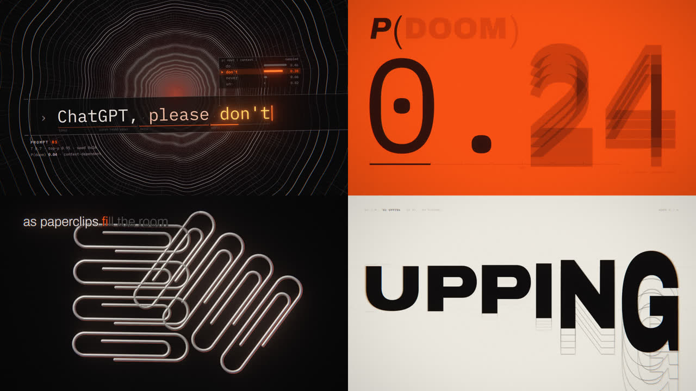
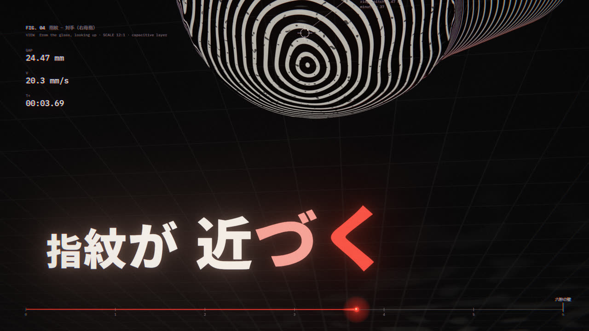
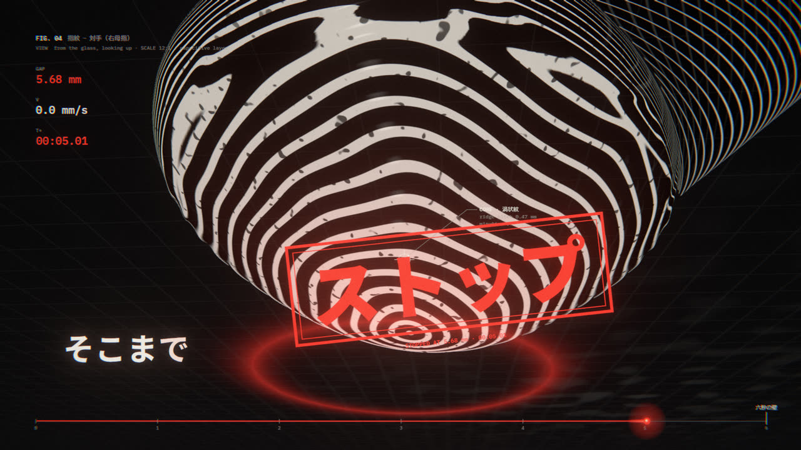
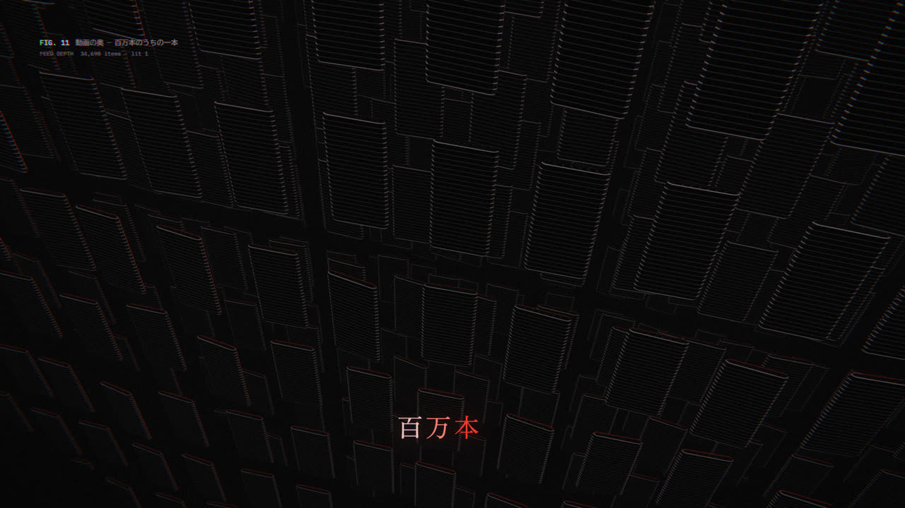
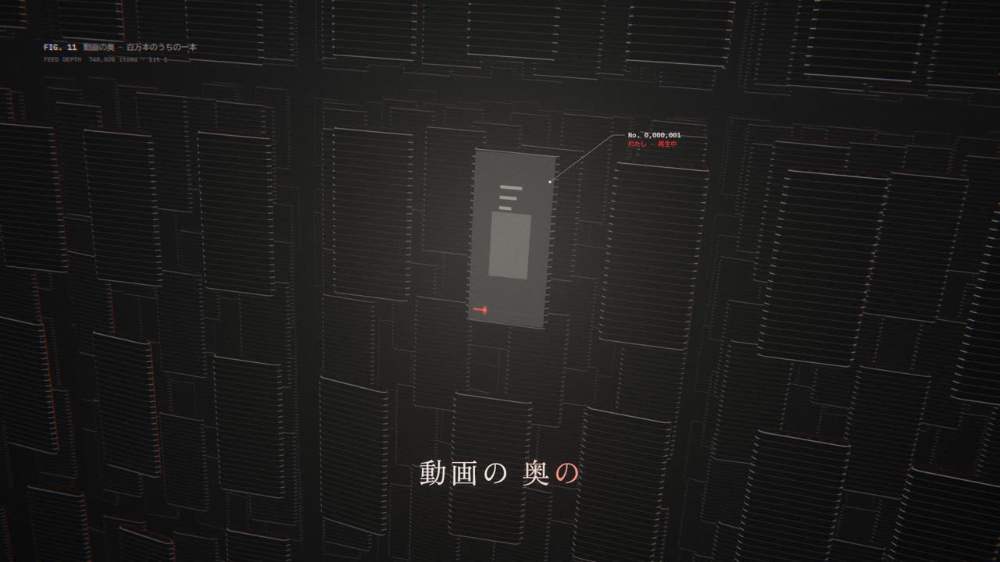
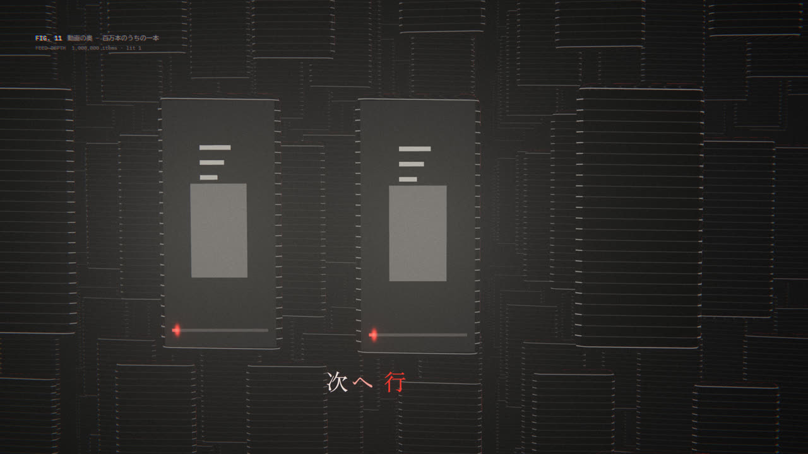
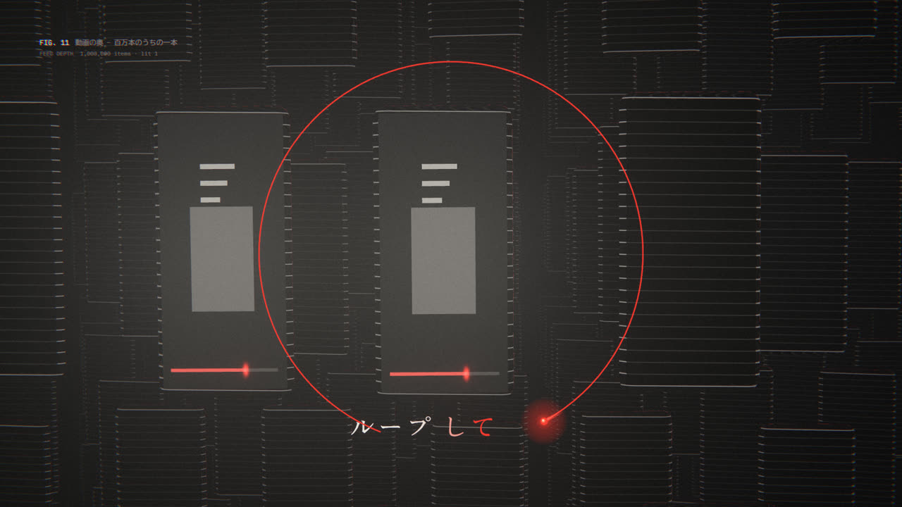

# EP36《六秒》代码 MV · S0 实验工程（云端做的）

> 这是 TREATMENT 里「S0（出歌前可做）」那一步：**3D 雕版渲染模块＋测试图版**，在云端先做好，拿回本地接着用。
> 做于 2026-10-03，云端会话（本地额度用完期间）。歌、真实对齐数据、EP35 引擎都在本地，这里**没有用到**。

## 先看效果

pdoom 原片（同一套引擎在云端渲染的 4 帧，用来对照质感）：

**测试图版 1 `thumb`**（主歌1「指紋が近づく／そこまでストップ」）：我们是手机，从玻璃下面往上看，对手的大拇指压下来。指纹是光线步进的 3D 雕版，**每一条雕版线就是一条指纹脊线**；屏幕的冷光从下面照，背光给一圈红边；标注像标本一样量它（FIG.、CORE、脊距、距离、速度）。字越近越大；「ストップ」那一拍全画面冻结，红色 STOP 章砸下来。

| 接近中 | ストップ（冻结） |
|---|---|
|  |  |

**测试图版 2 `deep`**（副歌3，安静段）：无限延伸的手机阵列（雕版钢、深雾、红色轮廓光），镜头往下沉；百万台里只亮一台（「わたしひとりを」）；「次へ行っても」滑到下一台——也亮着、同一张卡（循环）；「ループしてるよ」播放头离开进度条，绕着它画出 ↻。明朝体细字。

| 阵列 | 只亮一台 |
|---|---|
|  |  |
| **下一台也亮着** | **↻** |
|  |  |

运动样片（无声、30fps、无动态模糊）：`out/clips/` 里的 `thumb_test.mp4`、`deep_test.mp4`（不进 git，单独发）。

## 做了什么（文件）

| 文件 | 是什么 | 本地怎么用 |
|---|---|---|
| `app/src/scenes/_engrave.ts` | **3D 雕版公共模块**（TREATMENT 升级第 1 条）。场景只写距离场 `map()` 和"这块表面怎么刻" `surface()`；相机、步进、法线、软阴影、AO、线的抗锯齿（按像素足迹淡出防摩尔纹）、红色轮廓光、雾、4 点超采样都是共用的，所以每张 3D 图版看起来是同一种印刷工艺 | 直接拷进 EP36 的 `app/src/scenes/`。依赖 `engine/gl`（`FSPass`、`SS_TAP`）和 `GLSL_COMMON`，EP35 引擎是 pdoom 的分支，接口一样 |
| `app/src/scenes/_ep36.ts` | EP36 **母题和工具**：播放头（红点＋亮芯＋短尾）、进度条＋六秒之壁、时间码、**数字先乱跳 3–5 帧再落定**、**按情绪分的缓动曲线**（slam/write/liquid/morph/cam，数字来自 mg-styles-15）、逐字砸入（75ms 回弹＋1 帧 smear＋白热→红→骨白）、标注引线 | 同上。所有场景都用它，保证母题处处一致 |
| `app/src/scenes/thumb.ts` | 测试图版 1 | 作为 `judge` 场的后半；前半（秒表、REDACTED 黑条）还没做 |
| `app/src/scenes/deep.ts` | 测试图版 2 | 作为 `deep` 场 |
| `app/src/engine/palette.ts` | 改成 EP36 配色（signal=#FF3B2F 播放头红、ember、blood；`acid` 键改成点赞粉 #FF6FA8，只给终副歌约 2 秒） | 对照改 EP35 引擎的 palette |
| `app/src/engine/type.ts` | 加日文三种"嗓子"：`F.jp()` Noto Sans JP 400/500/700/900（可变字体，每个字重注册成一个 family）、`F.mincho()` Zen Old Mincho、`F.ud()` BIZ UDGothic；拉丁字体里的日文自动回退到 UD，不出豆腐块 | EP35 已有 Noto Sans JP/SC，按需合并 |
| `app/scripts/render.ts` | 加了一个开关：设了环境变量 `CHROME_PATH` 就用那个 Chromium＋SwiftShader（云端没显卡用）；不设就和原来一样 | 本地不用管 |
| `tools/make_placeholder_data.py` | **占位**时间数据：恒速 136 BPM、前奏 18 秒（真歌实测）、一行一小节、一字一个八分 | 本地**换成真实的** `data/lyrics.json`、`data/audio.json` |
| `tools/get_fonts.sh` | 下载日文字体（OFL） | 本地若已有字体可跳过 |

## 本地接手步骤（给本地 Claude）

1. 拉这个仓库：`git clone https://github.com/a690929617-netizen/rinshigyo`，分支 `claude/open-source-project-eval-irgch2`，目录 `ep36-lab/`。
2. 按 TREATMENT S0：先从 EP35 抽干净模板到 `EP36_六秒\代码MV\`，再把 `_engrave.ts`、`_ep36.ts`、`thumb.ts`、`deep.ts` 拷进 `app/src/scenes/`，配色和字体照上表合并进引擎。
3. 用本地已经做好的分轨＋逐音对齐生成真实 `data/*.json`（技能 code-lyric-mv 的 pipeline）。真歌速度 134→138 漂移，**按逐拍跟踪**，不要用这里的恒速占位。
4. 在 `timeline.ts` 里给 `thumb`、`deep` 开窗口（这里的 `ep36-lab/app/src/timeline.ts` 可参考，切点规则同 EP35）。
5. 渲静帧自审：`bun scripts/render.ts stills --t ... --only thumb`。有显卡会比云端快很多（云端约 8 秒/帧，单采样）。
6. ⚠️ **找歌词要限定在场景自己的窗口里**：`ly.get('わたし')` 会先匹配到主歌1的「お次はわたしだ」，这次就踩了（`deep.ts` 里已经改成只在窗口内找）。同一个坑 EP35 也记过。

## 自审：还差什么（按优先级）

- **thumb**：①主歌1第5–6句（秒表只走 2 秒、「顔」被 REDACTED 涂黑）还没做；②指纹现在是"漩涡＋噪声"，可以加三角点（delta）让它更像真指纹；③STOP 章可以加印泥质感（边缘不齐、缺墨）；④字目前平贴，TREATMENT 要求"至少 6 句贴在 3D 表面上"，这场的「近づく」很适合印到玻璃上被指腹压住。
- **deep**：①屏幕上的卡片是通用占位，可以换成"别人的视频"缩略雕版（猫、拉面…）；②注释层还偏少（pdoom 每帧都有刻度/编号/单位）；③镜头路径改成按「小节.拍」写关键帧；④「飛ばしてみなよ」（副歌3第1句）那半句属于 `hook` n=3，还没做。
- **两场共同**：没开动态模糊（云端只渲了单采样）；本地用 `--samples auto`。音频驱动（底鼓脉冲）这里用的是占位数据，换真数据后再调。

## 云端这次的发现

- pdoom 的引擎在云端没有显卡也能跑（Chromium＋SwiftShader），**单采样约 8 秒/帧**。适合做静帧和短样片；整首 200 秒×60fps 正式渲染要几十小时，还是本地显卡来做。
- B站被云端网络策略挡住，打不开你发的视频；拆解和核对清单见 [`docs/PDOOM_BREAKDOWN.md`](docs/PDOOM_BREAKDOWN.md)。

## 许可

- 引擎来自 [mexicat/pdoom-video](https://github.com/mexicat/pdoom-video)（MIT，© 2026 Giacomo Magnanini），见 `LICENSE-pdoom-video`；发布成品时在 CREDITS 里写上。
- 字体：Archivo、IBM Plex Mono、Cormorant Garamond、Noto Sans JP、Zen Old Mincho、BIZ UDGothic，都是 SIL OFL。
- 这里**没有**放 pdoom 的歌、歌词和数据（它们不属于 MIT）。
